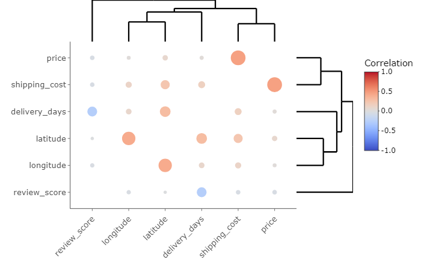

```{r setup, include=FALSE}
library(flexdashboard)
#library(devtools)
library(tidyr)
library(dplyr)
library(data.table)
library(tibble)
library(circlize)
library(sqldf)
library(plotly)
library(flexdashboard)
library(dygraphs)
library(xts)
library(leaflet)
library(heatmaply)
library(wordcloud)
library(RColorBrewer)
library(ggplot2)
library(tidytext)
library(stringr)
library(hunspell)
library(SnowballC)
library(xtable)
library(knitr)
library(kableExtra)
library(tm)
```

<style type="text/css">

.chart-title {  /* chart_title  */
   font-size: 30px;
   font-family: Arial;
  font-
</style>


About 
===================================== 

Row
-------------------------------------

### Dataset

The dataset I am using is Brazilian E-Commerce Public Dataset by Olist from kaggle (https://www.kaggle.com/olistbr/brazilian-ecommerce?select=olist_orders_dataset.csv).The dataset has information of 100k orders from 2016 to 2018 made at multiple marketplaces in Brazil. Its features allows viewing an order from multiple dimensions: from order status, price, payment and freight performance to customer location, product attributes and finally reviews written by customers. It also contained a geolocation dataset that relates Brazilian zip codes to lat/lng coordinates.

The Dataset Schema is shown on the right graphy. Since the dataset contains multiple csv files, to better ultilize the information, the "prcessdata.rmd" file is first run first to generate some other csv files for analysis followed. 

### Schema {.no-title}

```{r}
knitr::include_graphics("img/schema.png")
```


Row
-------------------------------------

### Objective

**The correlation heatmap and interative plots work good insids markdown but do not show up when knit to html. I have tried many methods but still could not fix it. For these plots, I have to save the screenshots and export them in the html. Full codes and plots are provided in r markdown file**


The objective of this project is to propose an analytical view of e-commerce relationship in Brazil. This project aims to provide insights from a reallife marketing dataset. 


To complete this goal, firstly, some exploratory data analysis is done to have a intuitive understanding of what is behind braziian online purchasing. In this part, some most important variables of an order are analysed specifially, including review score, seller and customer location, sales, order times and product categories. Then time series plots are given to see any possible trend behind the market. 

Using the state an geolocation data, the project also conduct geospatial analysis of order data. Some visual plots of distribution of order variables among states will be given. Also, the project plan to use the seller location as the source and customer location as the city, to do Neural Network visualizations similar to the Assignment 7 Migration Flow.


Finally, the project look at customers reviews and implement NLP tools to make a text analysis. Through removing stop words, tokenization and stemming, we analyze the sentiment contribution of words.


Row
-------------------------------------

### Tools


R 3.6.0 :

- library(tidyr)
- library(dplyr)
- library(data.table)
- library(tibble)
- library(circlize)
- library(flexdashboard)
- library(shiny)
- library(shinydashboard)
- library(tidyverse)
- library(DT)
- library(leaflet)
- library(geojsonio)
- library(dygraphs)
- library(sqldf)
- library(plotly)
- library(dygraphs)
- library(xts)
- library(heatmaply)
- library(wordcloud)
- library(RColorBrewer)
- library(ggplot2)
- library(tidytext)
- library(stringr)
- library(hunspell)
- library(SnowballC)
- library(xtable)
- library(knitr)
- library(kableExtra)
- library(tm)

```{r include=FALSE}
# import lib

```
```{r include=FALSE}
# loading dfs
df=read.csv("data/final_order.csv", stringsAsFactors = F)
NN= df %>%
        select(customer_state, seller_state)
NN1=sqldf("select seller_state,customer_state, count(*) as cnt from NN group by seller_state,customer_state")
NN1 = NN1 %>%
        filter(is.na(seller_state) == FALSE & is.na(customer_state)==FALSE)
# select top5 seller state
NN2 = NN1[NN1$seller_state %in% c("SP","MG","PR","RJ","SC"),]
NN3 = tibble::as_tibble(NN2) %>%
  group_by(seller_state) %>%
  arrange(cnt, .by_group = TRUE) %>%
  top_n(10)
```


1.1 By State {data-navmenu="1 EDA"}
=====================================

```{r include=FALSE}
seller=NN1 %>%
  select(seller_state,cnt)%>%
  group_by(seller_state)%>%
  summarise(selcnt=sum(cnt))%>%
  rename(state=seller_state)

customer=NN1 %>%
  select(customer_state,cnt)%>%
  group_by(customer_state)%>%
  summarise(cuscnt=sum(cnt))%>%
  rename(state=customer_state)

sc=customer %>% left_join(seller,by="state")
sc[is.na(sc)] <- 0
```
```{r include=FALSE}
#add value
sellervalue= df %>%select(seller_state,value)%>%group_by(seller_state)%>%summarise(selval=sum(value))%>%rename(state=seller_state)
sellervalue=drop_na(sellervalue)

customervalue= df %>%select(customer_state,value)%>%group_by(customer_state)%>%summarise(cusval=sum(value))%>%rename(state=customer_state)
customervalue=drop_na(customervalue)

scall=sc%>%left_join(customervalue,by='state')%>% left_join(sellervalue,by='state')
scall[is.na(scall)] <- 0
scall12=scall%>% arrange(selcnt,)%>%top_n(12)
```


Row
-------------------------------------

### 1.1 By State

For the first part of EDA part, we look into the total order times and sales by state. There are two kinds of states, customer states and seller states, which refer to the state the customers and seller located at, respectively. Firstly, we plot the order times by seller states and customer states seperately. The x-axis is th total order count and annotation indicates the millesimal of order count and total sales od each state. We can easily see that the rank of seller state and customer state by order count are not always corresponding. And that a few states take up majority of total orders.

Then we plot the total sales of top 12 states in one plot. SP, MG, RJ and PR take all most of the orders. Among this four states, SP and PR have more sellers than customers. 


Row
-------------------------------------


### by Seller States 

```{r fig.width=7, fig.height=7}
#scall1=scall%>%arrange(selcnt,)%>%top_n(15)
#fig1 <- fig1 %>% layout(autosize = F, width = 500, height = 500)
fig1 <- plot_ly(data=scall,x = scall$selcnt, y = ~reorder(scall$state, scall$selcnt), title = 'Orders Number and Total Sales by Seller States',
              type = 'bar', orientation = 'h',
              marker = list(color = 'lightcoral',
                            line = list(color = 'orangered', width = 1)),
              bargap = 0.15,
         autosize = F, width=400, height = 650) 
fig1 <- fig1 %>% layout(
         #title='Orders Number and Total Sales by Seller States', 
  tickfont = list(size = 14),font=list(size=10),showlegend = FALSE,automargin = TRUE,
         yaxis = list(title = 'Seller State',titlefont = list(size = 14)),
         xaxis = list(title = 'Orders Count',titlefont = list(size = 14)))

fig1 <- fig1 %>% add_annotations(xref = 'x1', yref = 'y',
                  x = scall$selcnt +20000,  y = scall$state,
                  text =
                    paste(round((scall$selcnt/sum(scall$selcnt))*1000, 2), '‰ , ', round(scall$selval/(5.17*1000),2),'k$'),
                  font = list(family = 'Arial', size = 10, color = 'grey'),showarrow = FALSE)

fig1
```

> Figure 1.1.1:Orders Number and Total Sales by Seller States

### by Customer States {data-padding=10,data-height=650}
```{r fig.width=7, fig.height=7}
fig2 <- plot_ly(data=scall,x = scall$cuscnt, y = ~reorder(scall$state, scall$selcnt),type = 'bar', orientation = 'h',
              marker = list(color = 'orange',
                            line = list(color = 'peru', width = 1)),
              bargap = 0.15,
         autosize = F, width=400, height = 650) 
fig2 <- fig2 %>% layout(
         #title='Orders Number and Total Sales by Customer States', 
  tickfont = list(size = 14),font=list(size=10),showlegend = FALSE,automargin = TRUE,
         yaxis = list(title = 'Customer State',titlefont = list(size = 14)),    xaxis = list(title = 'Orders Count',titlefont = list(size = 14)))

fig2 <- fig2 %>% add_annotations(xref = 'x1', yref = 'y',
                  x = scall$cuscnt +20000,  y = scall$state,
                  text =
                    paste(round((scall$cuscnt/sum(scall$cuscnt))*1000, 2), '‰ , ',
                      round(scall$cusval/(5.17*1000),2),'k$'),
                  font = list(family = 'Arial', size = 10, color = 'grey'),showarrow = FALSE)

fig2
```

> Figure 1.1.2:Orders Number and Total Sales by Customer States

Row
-------------------------------------

### Sales by Top 12 States

```{r}
fig12 <- plot_ly(data=scall12,x = ~reorder(scall12$state, scall12$selval), y = scall12$selval, type = 'bar', name = 'by Seller Sates',
        marker = list(color = 'lightcoral',
                      line = list(color = 'orangered', width = 1)))
#,autosize = F, width=400, height = 500)
fig12 <- fig12 %>% add_trace(y = scall12$cusval, name = 'by Customer State', marker = list(color = 'orange',line = list(color = 'peru', width = 1)))
fig12 <- fig12 %>% layout(#title = 'Olist Sales by Top 12 States',
         xaxis = list(title = "",tickfont = list(size = 14)),
         yaxis = list(title = 'USD (K)',titlefont = list,size = 14),               tickfont = list(size = 12),
         legend = list(x = 0, y = 1),
         barmode = 'group', bargap = 0.2, bargroupgap = 0.1
        )

fig12
```

>Figure 1.1.3: Olist Sales by Top 12 States


1.2 By Category {data-navmenu="1 EDA"}
=====================================


Row
-------------------------------------

### 1.2 By Category


For the second part of EDA part, we look into the total order times and sales by category. The products can be classified into 66 sub-categories and 11 categories. Both types of categroies are analysed.

For sub-categories, we plot pie chart with order times and sales. We can see that customers order bed, bath & table, health & beauty, sport leisure, computers accessories, furniture & decoration(etc.) most frequently and also spend more money on these products too. We can see the the top 12 sub-categories products account for 71.4% of total orders and 69.7% of total sales.


For categories, There are five categories which take up more than 10% of the total sales. The most popular are Household Textiles products, which account for 30.8% of the total sales.

Row
-------------------------------------
```{r}
cat=sqldf("select product_category,count(*) as cnt from df group by product_category")
cat=drop_na(cat)
```
```{r include=FALSE}
cat%>%arrange(cnt, ) %>%top_n(12)
cat12=cat %>% 
        mutate(category = case_when(
          product_category == "sports_leisure" ~"sport leisure",
          product_category == "computers_accessories" ~"computers accessories",
          product_category == "furniture_decor" ~"furniture & decoration",
          product_category == "housewares" ~"housewares",
          product_category == "watches_gifts" ~"watches gifts",
          product_category == "telephony" ~"telephony",
          product_category == "auto" ~"auto",
          product_category == "toys" ~"toys",
          product_category == "cool_stuff" ~"cool tuff",
          product_category == "garden_tools" ~"garden tools",
          product_category == "health_beauty" ~"health & beauty",
          product_category == "bed_bath_table" ~"bed, bath & table",
          TRUE ~"Others"))
```

### Times by Sub-Categories

```{r}
cat12=cat12%>%arrange(category, )
#Add color
colors1=c("orangered2","plum2","paleturquoise2","palevioletred2","salmon","turquoise1","yellow2","sienna1","tomato1","seagreen3","seagreen","slategray3","tan3")
#cat122=cat12 %>% group_by(category)%>%summarise(cnt=sum(cnt))
#cat122$color=colors1
fig3 <- plot_ly(cat12, labels = ~category, values = ~cnt, type = 'pie',
        textposition = 'inside',
        textinfo = 'label+percent',showlegend = FALSE,
        marker = list(colors = colors1,
                      line = list(color = '#FFFFFF', width = 1)))
fig3 <- fig3 %>% layout(#title = 'Olist Orders Times by Product Sub-Categories',
      xaxis = list(showgrid = FALSE, zeroline = FALSE, showticklabels = FALSE),yaxis = list(showgrid = FALSE, zeroline = FALSE, showticklabels = FALSE))
fig3
```

>Figure 1.2.1: Olist Orders Times by Product Sub-Categories

### Sales by Sub-Categories
```{r}
catvalue= df %>%
  select(product_category,value)%>%
  group_by(product_category)%>%
  summarise(totalvalue=sum(value)/5.17)
catvalue=drop_na(catvalue)
catvalue12=catvalue %>%
  left_join(cat12, by = "product_category")%>%select(product_category,category,totalvalue)
```
```{r}
#catvalue12=catvalue12%>%arrange(category, )
colors2=c("orangered2","plum2","paleturquoise2","palevioletred2","salmon","seagreen3","turquoise1","yellow2","tomato1","sienna1","slategray3","tan3","seagreen")
fig4 <- plot_ly(catvalue12, labels = ~category, values = ~totalvalue, type = 'pie',
        textposition = 'inside',
        textinfo = 'label+percent',showlegend = FALSE,
        marker = list(colors = colors2,
                      line = list(color = '#FFFFFF', width = 1)))
fig4 <- fig4 %>% layout(#title = 'Olist Orders Sales by Product Sub-Categories',
      xaxis = list(showgrid = FALSE, zeroline = FALSE, showticklabels = FALSE),yaxis = list(showgrid = FALSE, zeroline = FALSE, showticklabels = FALSE))
fig4
```

>Figure 1.2.2: Olist Orders Sales by Product Sub-Categories

Row
-------------------------------------

### Sales by Categories
```{r include=FALSE}
de_cat_df=read.csv("data/detailed_cat_df.csv", stringsAsFactors = F)
largecat=de_cat_df%>% select(total_sales,salesperitem,avg_review,category)%>% group_by(category)%>%
  summarise(total_sales=round(sum(total_sales)/5.17,2),salesperitem=round(mean(salesperitem)/5.17,2),avg_review=round(mean(avg_review),2))
```

```{r }
colors3=c("orangered2","plum2","paleturquoise2","palevioletred2","salmon","seagreen3","turquoise1","yellow2","tomato1","sienna1","slategray3","tan3","seagreen")
fig5 <- plot_ly(largecat, labels = ~category, values = ~total_sales, type = 'pie',
        textposition = 'inside',
        textinfo = 'percent',showlegend = TRUE,
        marker = list(colors = colors3,
                      line = list(color = '#FFFFFF', width = 1)))
fig5 <- fig5 %>% layout(#title = list(text='Olist Orders Sales by Product Categories'),
      xaxis = list(showgrid = FALSE, zeroline = FALSE, showticklabels = FALSE),yaxis = list(showgrid = FALSE, zeroline = FALSE, showticklabels = FALSE))
fig5
```


>Figure 1.2.3: Olist Orders Sales by Product Categories

1.3 More {data-navmenu="1 EDA"}
=====================================

Row
-------------------------------------

### ss {.no-title}

- Figure 1.3.1: The plot shows th relationship of products review score and unit price by different categories. The size of the buble indicates the total sales of each categories. Among all, Services has the lowest average review score of 3.76 and unit price at average level. The most satisfation products are music,films and books, have the highest average review score of 4.28 and also the relatively low unit price. Eletrical goods have the highest unit price of 55.5$ but review score at average level.


- Figure 1.3.2: The plot shows the relationship of product price distribution by different products review score. The middle score, which is 3, has the smallest price range. Other than that, the shape of violins are a bit different but ther is no obvious pattern.

- Figure 1.3.3: The plot shows the correlation heatmap of the numeric variables of order: review score,deliver days, shipping cost, price, longitute and latitude. There are not strong correlation. Price and shipping cost is somewhat positively related. Besides, review score and shipping deliver days is negatively related.


Row {.tabset .tabset-fade}
-------------------------------------

### 1.3.1 Review Score VS Unit Price 

```{r }
fig5 <- plot_ly(largecat, x = ~avg_review, y = ~salesperitem, text = ~category, type = 'scatter', mode = 'markers', size = ~total_sales, color = ~category, colors = colors3,
        sizes = c(20,100),
        marker = list(opacity = 0.8,symbol = 'circle', sizemode = 'diameter',line = list(width = 2, color = '#FFFFFF')))#,
        #autosize = F, width=600, height = 400)
fig5 <- fig5 %>% layout(#title = 'Products Review Score VS Unit Price by Categoris',
  showlegend = TRUE,automargin = TRUE,
         xaxis = list(title = 'Products Review Average Score(of 5)',titlefont = list(size = 14),showgrid = FALSE),
         yaxis = list(title = 'Products Unit Price($)',titlefont = list(size = 14),showgrid = FALSE),
         paper_bgcolor = 'rgb(243, 243, 243)',
         plot_bgcolor = 'rgb(243, 243, 243)')

fig5
```

> Figure 1.3.1: Products Review Score VS Unit Price by Categoris


### 1.3.2 Review Score VS Price 
```{r}
set.seed(12)
dfs=df[sample(nrow(df),1000,replace=F),]
```

```{r }
fig6 <- dfs %>%plot_ly(x = ~review_score,y = ~value/5.17,split = ~review_score,
    type = 'violin',box = list(visible = T),
    meanline = list(visible = T))
   

fig6 <- fig6 %>%layout(xaxis = list(title = "Review Score"),yaxis = list(title = "Product Value",zeroline = F))

fig6
```


> Figure 1.3.2: Products Review Score VS Price


### 1.3.3 Correlation Heatmap 

```{r include=FALSE}
dfnum=df%>%select(value,review_score,lat,lng,shipping_cost,delivery_days)%>%rename(price=value,latitude=lat,longitude=lng)
set.seed(12)
dfnums=dfnum[sample(nrow(dfnum),1000,replace=F),]
dfnums=drop_na(dfnums)
```
```{r}
# Compute correlation coefficients
cor.coef <- cor(dfnums)

# Compute correlation p-values
cor.test.p <- function(x){
    FUN <- function(x, y) cor.test(x, y)[["p.value"]]
    z <- outer(
      colnames(x), 
      colnames(x), 
      Vectorize(function(i,j) FUN(x[,i], x[,j]))
    )
    dimnames(z) <- list(colnames(x), colnames(x))
    z
}
p <- cor.test.p(dfnums)

# Create the heatmap
heatmaply_cor(
  cor.coef,
  node_type = "scatter",
  point_size_mat = -log10(p), 
  point_size_name = "-log10(p-value)",
  label_names = c("x", "y", "Correlation")
)

```
```{r}

```


> Figure 1.3.3: Correlation Heatmap


2 Time Series
=====================================

Row
-------------------------------------

### ss {.no-title}

Below plots show total sales and sales by categories along time. We can see that the shape and trend of each line is similar. All lines reach high peak on Nov,24,2017. All lines share the same trend: gradually went up from Jan 2017, reached high peak around Nov 2017, dropped to lowest point around Jan 2018, went up again and stayed at a level with some rise and fall.

Row {.tabset .tabset-fade}
-------------------------------------

### Total Sales

```{r include=FALSE}
#library(dygraphs)
#library(xts)
time_df = read.csv("data/time_df.csv", stringsAsFactors = F)
ts=time_df
ts$purchase_date=as.Date(ts$purchase_date, format="%Y-%m-%d",tz = "UTC")
ts$salesbyday=round(ts$salesbyday/5.17,0)
ts <- xts(x = ts$salesbyday, order.by = ts$purchase_date)
#summary(ts)
#head(ts)
```
```{r }
dygraph(ts, main = "Total Sales" ,ylab = "Total Sales($)",height = 300,width=580) %>% 
  dySeries("V1", label = "Sales")   %>% 
  dyShading(from = "2017-01-01", to = "2018-01-01") 
#%>%dyRangeSelector(height = 30, strokeColor = "drakblue")
```
```{r}
knitr::include_graphics("img/ts1.png")
```


> Figure 2.1: Total Sales 


### Total Sales By Categories

```{r}
cat_time_df = read.csv("data/cat_time_df.csv", stringsAsFactors = F)
catts=cat_time_df
catts$purchase_date=as.Date(catts$purchase_date, format="%Y-%m-%d",tz = "UTC")
#catts <- xts(x = catts[,-2], order.by = catts$purchase_date)
#summary(catts)
```
```{r}
#plot with categories
catts3=catts%>%select(purchase_date,Household.Textiles,Eletrical.Goods,Chemists.Drgustores)
catts3 <- xts(x = catts3[,-1], order.by = catts3$purchase_date)
catts3$Household.Textiles=catts3$Household.Textiles/5.17
catts$Chemists.Drgustores=catts$Chemists.Drgustores/5.17
catts$Eletrical.Goods=catts3$Eletrical.Goods/5.17
catts_2 <- xts(x = catts[,-1], order.by = catts$purchase_date)
catts_2=catts_2/5.17
```
```{r }
dygraph(catts_2, main = "Total Sales By Categories" ,ylab = "Total Sales($)",height = 300,width=580) %>% 
  dyShading(from = "2017-01-01", to = "2018-01-01") %>%
  #dySeries("Household.Textiles", stepPlot = TRUE, color = "orange") %>% 
  #dyGroup(c("Chemists.Drgustores", "Eletrical.Goods"), drawPoints = FALSE, color = c("seagreen","plum"))%>% 
  dyRangeSelector(height = 30, strokeColor = "darkblue") %>%
  dyHighlight(highlightCircleSize = 4, 
              highlightSeriesBackgroundAlpha = 0.2,
              hideOnMouseOut = FALSE,
              highlightSeriesOpts = list(strokeWidth = 1))
```
```{r}
knitr::include_graphics("img/ts2.png")
```

> Figure 2.1: Total Sales By Categories


3 Geographic
=====================================

Row
-------------------------------------

### ss {.no-title}

Three geographic plots are given: by sales, review score and deliver days.

We can see that the South-East coastal areas generally have higher sales, higher review score and shorter deliver days. This is reasonable since cities in South-East coastal areas have larger population and more developed, thus it is likely that more customers and sellers living in these areas and that the transportation system are better. 

Giving this reason, Amazona seen to be abnormal, with much longer deliver days of over 20 days but relatively high review score. But it shoud be noticed that this state only has total sale of 5.56k$, much lower than most states. This could mean that this state may be not classic enough.


 
Row {.tabset .tabset-fade}
-------------------------------------

```{r include=FALSE}
geo_df = read.csv("data/geo_df.csv", stringsAsFactors = F)
states = geojsonio::geojson_read("data/br-states.json", what = "sp")
```
   
### Sales

```{r}
pal = colorBin("Reds",(geo_df[, "sales"]/5.17), bins = c(0,10000,20000,40000,60000,100000,200000,500000,1000000,Inf),pretty = F)
labels =paste(sep = "<br/>",
  sprintf("%s Sales: %s k$ ",
                 states$nome, 
                 format( round(geo_df[, "sales"]/(5.17*1000),2),scientific = F,big.mark = ",")))

geo = leaflet(states) %>%
  addTiles() %>%
  addPolygons(
    fillColor = ~ pal(geo_df[, "sales"]/5.17),
    weight = 2,opacity = 1,color = "lightgrey", dashArray = "2",
    fillOpacity = 0.6,
    highlight = highlightOptions(weight = 4,color = "orangered",
                                 dashArray = "",fillOpacity = 0.5,
                                 bringToFront = TRUE),
    label = labels,
    labelOptions = labelOptions(style = list( "font-weight" = "normal",
                                              padding = "3px 8px"),
                                        textsize = "12px",
                                        direction = "auto"))
geo =geo %>% addLegend(pal = pal,values = (geo_df[, "sales"]/5.17),opacity = 0.7,title = "Total Sales",position = "bottomright")

geo
```
```{r}
knitr::include_graphics("img/geo1.png")
```
 
### Review Score
    
```{r}
pal1 = colorBin("Greens",geo_df[, "avg_review"], bins = c(3.75,3.85,3.90,3.95,4.00,4.05,4.10,4.15,4.20,4.25),pretty = F)
labels1 = sprintf("%s Average Review Score: %s ",
                 states$nome, 
                 format( geo_df[, "avg_review"],scientific = F,big.mark = "," ))
geo1 = leaflet(states) %>%
  addTiles() %>%
  addPolygons(
    fillColor = ~ pal1(geo_df[, "avg_review"]),
    weight = 2,opacity = 1,color = "lightgrey", dashArray = "2",
    fillOpacity = 0.6,
    highlight = highlightOptions(weight = 4,color = "seagreen",
                                 dashArray = "",fillOpacity = 0.5,
                                 bringToFront = TRUE),
    label = labels1,
    labelOptions = labelOptions(style = list( "font-weight" = "normal",
                                              padding = "3px 8px"),
                                        textsize = "12px",
                                        direction = "auto"))
geo1 %>%addLegend(pal = pal1,values = geo_df[, "avg_review"],
                 opacity = 0.7,title = "Average Review Score",position = "bottomright")
```
```{r}
knitr::include_graphics("img/geo2.png")
```

### Deliver Days

```{r}
pal2 = colorBin("Blues",geo_df[, "avg_delidays"], bins = c(8,10.0,12.5,15.0,17.50,20.0,22.5,25.0,27.5,30),pretty = F)
labels2 = sprintf("%s Average Deliver Days: %s ",
                 states$nome, 
                 format( geo_df[, "avg_delidays"],scientific = F,big.mark = "," ))
geo2 = leaflet(states) %>%
  addTiles() %>%
  addPolygons(
    fillColor = ~ pal2(geo_df[, "avg_delidays"]),
    weight = 2,opacity = 1,color = "lightgrey", dashArray = "2",
    fillOpacity = 0.6,
    highlight = highlightOptions(weight = 4,color = "darkblue",
                                 dashArray = "",fillOpacity = 0.5,
                                 bringToFront = TRUE),
    label = labels2,
    labelOptions = labelOptions(style = list( "font-weight" = "normal",
                                              padding = "3px 8px"),
                                        textsize = "12px",
                                        direction = "auto"))
geo2 %>%addLegend(pal = pal2,values = geo_df[, "avg_delidays"],
                 opacity = 0.7,title = "Average Deliver Days",position = "bottomright" )
```
```{r}
knitr::include_graphics("img/geo3.png")
```

4 Network
=====================================

Row
-------------------------------------

### ss {.no-title}

We use the seller states and customer states as nodes, to do Neural Network visualizations similar to the Assignment 7 Migration Flow. Two kinds of Network plots are made. In the "From Top 5 Seller States" plot, we use seller states as source and customer states as target. We visualize the main product flow from top 5 seller states, to see where the products most likely went to. In the "To Top 5 Customer States" plot, we use customer states as source and seller states as target. We visualize the main product flow to top 5 customer states, to see where the products are most from.

From plots, sellers from SP, MG, PR, RJ and SC completes most orders, and apart from themselves, they sells majority of their products to RS, BA and DF. Customers from SP, MG, RJ,RS and PR buy most products and apart from themselves, they buys majority of their products from SC, BA and DF.

 
Row {.tabset .tabset-fade}
-------------------------------------

### From Top 5 Seller States

```{r fig.height=7, fig.width=7, message=FALSE, warning=FALSE}
circos.clear()
chordDiagram(NN3,  annotationTrack = c("name", "grid"),
             annotationTrackHeight = c(0.03, 0.01),
             transparency = 0.2,big.gap = 1,
             order = c("SP","MG","PR","RJ","SC","RS","DF","BA","GO","PE","MA","ES","MT","CE"),
             grid.col = c(SP="orange",MG="orchid",PR="turquoise",
RJ="springgreen",SC="palevioletred",RS="tan",DF="tan",BA="tan",GO="tan",ES="tan"))
title("Products Transportation from Top 5 Seller States", cex = 0.6)
```


### To Top 5 Customer States

```{r include=FALSE}
# select top5 customer state
NN4 = NN1[NN1$customer_state %in% c("SP","MG","RJ","RS","PR"),]
NN5 = tibble::as_tibble(NN4) %>%
  group_by(customer_state) %>%
  arrange(cnt, .by_group = TRUE) %>%
  top_n(8)
```
```{r fig.height=7, fig.width=7, message=FALSE, warning=FALSE}
circos.clear()
chordDiagram(NN5,  annotationTrack = c("name", "grid"),
             annotationTrackHeight = c(0.03, 0.01),
             transparency = 0.2,big.gap = 1,
             order = c("SP","MG","RJ","PR","RS","SC","DF","BA","GO","PE","MA","ES","MT","CE"),
             grid.col = c(SP="orange",MG="orchid",PR="turquoise",
RJ="springgreen",RS="royalblue",SC="tan",RS="tan",DF="tan",BA="tan",GO="tan",ES="tan"))
title("Products Transportation to Top 5 Customer States", cex = 0.6)
```

5 NLP
=====================================


```{r include=FALSE}
data=read.csv("data/reviews.csv")
#Create a vector containing only the text
text <- data$review_comment_message
# Create a corpus  
docs <- Corpus(VectorSource(text))
```
```{r include=FALSE}
cleaned_text <- data %>%
  filter(str_detect(review_comment_message, "^[^>]+[A-Za-z\\d]") | review_comment_message !="")%>%select(review_id,review_comment_message,review_score)%>%
  rename(msg=review_comment_message,score=review_score,id=review_id)
cleaned_text$msg <- gsub("[_]", "", cleaned_text$msg)
cleaned_text$msg <- gsub("<br />", "", cleaned_text$msg)
```
```{r}
#Tokenization
text_df <- tibble(id = cleaned_text$id , msg = cleaned_text$msg,score=cleaned_text$score)
text_df <- text_df %>%  unnest_tokens(word, msg)
```
```{r include=FALSE}
#Stemming
getStemLanguages() %>%
  kable() %>%
  kable_styling(bootstrap_options = c("striped", "hover", "condensed"), full_width = F)
text_df$word <- wordStem(text_df$word,  language = "portuguese")
```
```{r include=FALSE}
head(table(text_df$word)) %>%
  kable() %>%
  kable_styling(bootstrap_options = c("striped", "hover", "condensed"), full_width = F)
data(stop_words)
text_df <- text_df %>% 
  anti_join(stop_words, "word")
text_df1=text_df%>%filter(word != "茫" & word != "茅" & word != "贸" & word != "谩" & word != "莽" )
```


Row
-------------------------------------

### ss {.no-title}

Finally, the project look at customers reviews and implement NLP tools to make a text analysis. Through removing stop words, tokenization and stemming, we analyze the sentiment contribution of words. Word frequency plot and wordcloud by positive and negative are given.


Row {.tabset .tabset-fade}
-------------------------------------


```{r}
textf1= text_df1%>% 
  count(word, sort = TRUE) %>% 
  filter(n > 3000) %>% 
  mutate(word = reorder(word, n))
```


### Most Common Words of Positive and Negative

```{r include=FALSE}
Sentiment_Analysis <- text_df1 %>% 
  inner_join(get_sentiments("bing"), "word") %>% 
  count(id,sentiment) %>% 
  spread(sentiment, n, fill = 0) %>% 
  mutate(sentiment = positive - negative)
Sentiment_Analysis_Word_Count <- text_df %>% 
  inner_join(get_sentiments("bing"), "word") %>% 
  count(word, sentiment, sort = TRUE) %>% 
  ungroup()
```
```{r}
#Most Common Positive and Negative Words.
Sentiment_Analysis_Word_Count %>% 
  group_by(sentiment) %>% 
  top_n(12, n) %>%
  ungroup() %>%
  mutate(word = reorder(word, n)) %>%
  ggplot(aes(word, n, fill = sentiment)) + 
  geom_col(show.legend = FALSE) + 
  facet_wrap(~sentiment, scales = "free_y") + 
  labs(y = "Contribution to Sentiment", x = NULL) + 
  coord_flip()
```


### WordCloud

```{r}
wordcloud(words = Sentiment_Analysis_Word_Count$word, freq = Sentiment_Analysis_Word_Count$n, min.freq = 1,           
          max.words=200, random.order=FALSE, rot.per=0.35,            colors=brewer.pal(12, "Set3"))
```


### Positive WordCloud
```{r}
pos=Sentiment_Analysis_Word_Count%>%
  filter(sentiment=="positive")
neg=Sentiment_Analysis_Word_Count%>%
  filter(sentiment=="negative")
```

```{r }
wordcloud(words = pos$word, freq = pos$n, min.freq = 1,           
          max.words=200, random.order=FALSE, rot.per=0.35,colors ="red")
```

### Negative WordCloud

```{r}
wordcloud(words = neg$word, freq = neg$n, min.freq = 1,           
          max.words=200, random.order=FALSE, rot.per=0.35,            colors="darkBlue")
```

